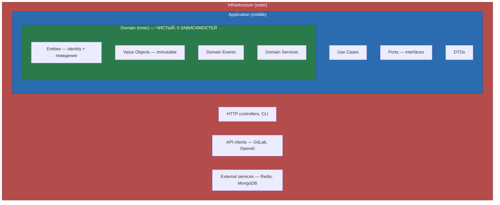
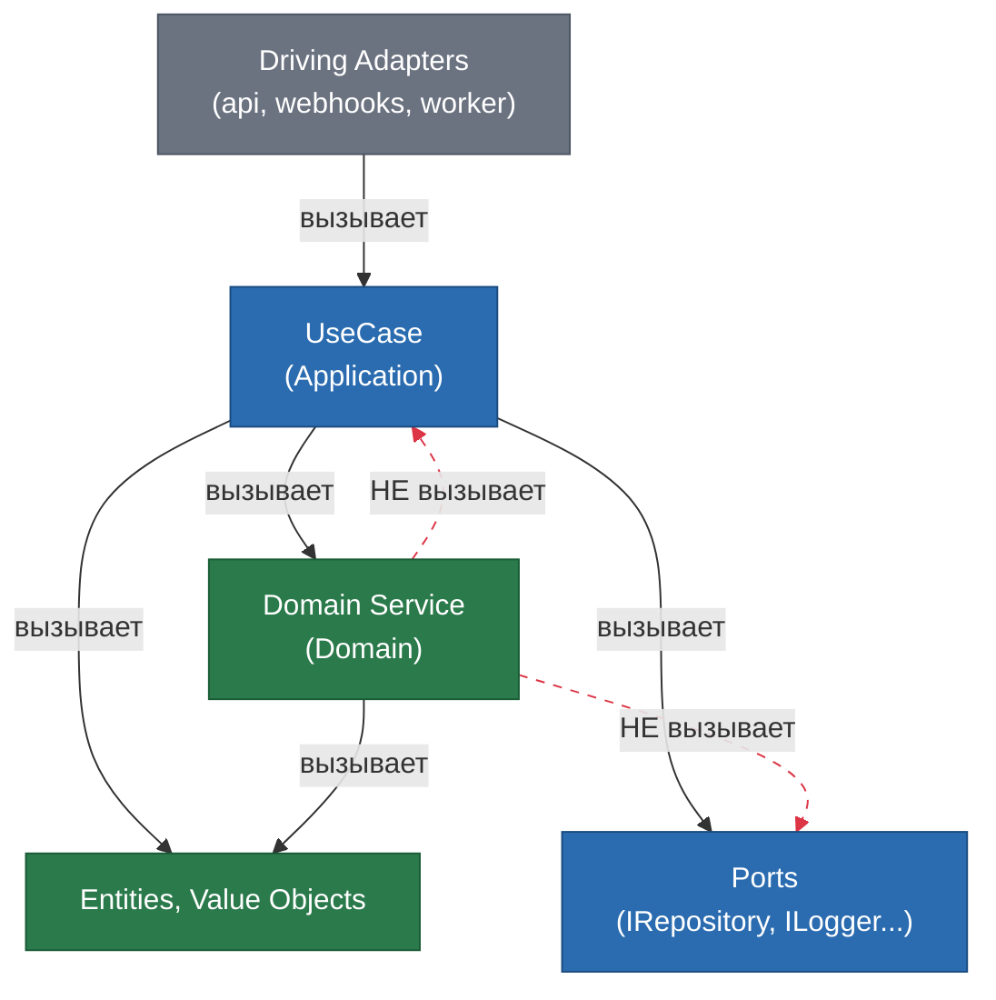

## Архитектура

### Clean Architecture + Hexagonal (Ports & Adapters)

**Правило зависимостей — абсолютное, без исключений:**

> Зависимости направлены ТОЛЬКО внутрь: Infrastructure -> Application -> Domain

- Domain **НЕ импортирует** Application и Infrastructure
- Application **НЕ импортирует** Infrastructure
- Все внешние зависимости через **порты** (`application/ports/`)

**Порты:**

- `inbound/` (driving) — `IUseCase` интерфейсы. Как мир вызывает нас
- `outbound/` (driven) — `IRepository`, `IEventBus`, provider-интерфейсы. Что мы вызываем

### DDD (Domain-Driven Design)

| Концепт        | Где                           | Правило                                                                |
|----------------|-------------------------------|------------------------------------------------------------------------|
| Entity         | `domain/entities/`            | Identity через UniqueId, сравнение по id, **обязательно с поведением** |
| Value Object   | `domain/value-objects/`       | Immutable, сравнение по значению, валидация в конструкторе             |
| Aggregate Root | `domain/aggregates/`          | Extends Entity, domain events, единица консистентности                 |
| Factory        | `domain/factories/`           | `IEntityFactory<T>`. Каждый Entity/Aggregate — своя фабрика            |
| Domain Event   | `domain/events/`              | Immutable, past tense (`ReviewCompleted`)                              |
| Domain Error   | `domain/errors/`              | Extends DomainError, уникальный `code`                                 |
| Domain Service | `domain/services/`            | Бизнес-логика вне одной entity                                         |
| Repository     | `application/ports/outbound/` | **Только interface** в core                                            |
| DTO            | `application/dto/`            | Пересекает границы слоёв. Нет логики                                   |

- **Бизнес-логика** (правила, валидации, вычисления, инварианты) — **ТОЛЬКО** в domain layer
- **Оркестрация** (последовательность вызовов: получи из порта → передай в domain → сохрани результат) — в Use Cases
- Use Cases **не содержат** if/else по бизнес-правилам. `if (user.canReview())` — ок (делегирует в entity),
  `if (user.role === "admin")` — нет (бизнес-правило в use case)
- Один Aggregate = одна транзакция. Между агрегатами — domain events

**UseCase vs Domain Service (полная цепочка вызовов):**

- **Кто вызывает UseCase:** только Driving-адаптеры (`api` → Controller, `webhooks` → Handler, `worker` → Consumer)
- `ui` вызывает UseCase **косвенно** — через HTTP → `api` → UseCase
- UseCase **может** вызывать другой UseCase (композиция внутри Application слоя)

|                | UseCase                                           | Domain Service                                     |
|----------------|---------------------------------------------------|----------------------------------------------------|
| Слой           | `application/use-cases/`                          | `domain/services/`                                 |
| Суффикс        | `+UseCase` (`CollectFeedbackUseCase`)             | `+Service` (`RuleEffectivenessService`)            |
| Реализует      | `IUseCase<In, Out, Err>`                          | Свой интерфейс или класс                           |
| Роль           | Оркестрация потока (получи → обработай → сохрани) | Чистая бизнес-логика вне одной entity              |
| Зависимости    | Ports, Domain Services, Entities                  | Только Domain objects (Entity, VO)                 |
| Знает о портах | Да (`IRepository`, `ILogger`, `ICache`...)        | **Нет** — данные только через параметры от UseCase |

- UseCase **может** вызывать Domain Service — это нормальная зависимость Application → Domain
- Domain Service **НЕ может** вызывать UseCase — это нарушение направления зависимостей
- Если класс реализует `IUseCase<In, Out>` — суффикс `UseCase`, **не** `Service`
- Если класс содержит чистую бизнес-логику без портов — суффикс `Service`, живёт в `domain/services/`
- **Не путай:** имя определяет слой и роль. `FooService` в `application/` — антипаттерн

**Фабрики (обязательно для каждого Entity/Aggregate):**

- Каждый Entity и Aggregate Root **обязан** иметь фабрику, реализующую `IEntityFactory<T>`
- `create()` — создание нового объекта (валидация, генерация id)
- `reconstitute()` — восстановление из persistence (маппинг из БД в domain)
- Entity **НЕ содержит** static `create()` — создание только через фабрику
- Фабрика живёт в `domain/factories/`, файл `<entity-name>.factory.ts`

### IoC (Inversion of Control)

**9 процессов в `@codenautic/runtime` — два типа контейнеров:**

| Контейнер                         | Где используется                                                     | Назначение                  |
|-----------------------------------|----------------------------------------------------------------------|-----------------------------|
| `Container` из `@codenautic/core` | `core`, `adapters`, `runtime` (workers, webhooks, scheduler, mcp) | Пакеты без HTTP-фреймворка  |
| NestJS DI                         | `runtime` (api)                                                      | HTTP-слой с NestJS модулями |

**9 Composition Roots (процессов в `@codenautic/runtime`):**

| Процесс               | IoC Container | Подключает домены из adapters        |
|-----------------------|---------------|--------------------------------------|
| `api`                 | NestJS DI     | git, llm, ctx, notif, msg, ast (все) |
| `webhooks`            | Container     | git, msg                             |
| `review-worker`       | Container     | git, llm, ctx, msg                   |
| `scan-worker`         | Container     | git, ast, msg                        |
| `agent-worker`        | Container     | git, llm, ctx, msg                   |
| `notification-worker` | Container     | notif, msg                           |
| `analytics-worker`    | Container     | ctx, msg                             |
| `scheduler`           | Container     | msg                                  |
| `mcp`                 | Container     | —                                    |

- Все 9 процессов — в одном пакете `@codenautic/runtime`; внутренняя структура файлов может меняться
- Каждый процесс подключает через DI **только нужные** домены из `@codenautic/adapters`
- В `api`: **NestJS DI — единственный контейнер**. Core Container НЕ используется
- TOKENS из `@codenautic/core` используются как NestJS injection tokens (`provide: TOKENS.Common.Logger`)
- В workers и webhooks: `Container` из core, `createToken<T>("name")` для типобезопасных токенов
- `ui` — HTTP-клиент, вызывает `api` по сети
- **Никогда** `new ConcreteClass()` внутри use cases — только IoC
- Singleton — для stateless. Stateful — transient

### Anti-Corruption Layer

- Каждая внешняя система — свой ACL: `IAntiCorruptionLayer<TExternal, TDomain>`
- Внешние типы **никогда** не проникают в domain
- Домены в `@codenautic/adapters` (`git/`, `llm/`, `context/`, `notifications/`) — ACL по определению

### Философия проекта

**Это не MVP. Это полноценный продукт. Мы строим на будущее и не жертвуем ничем.**

Проект спланирован на 4 фазы с полной roadmap от Launch до Self-Improvement. Никаких shortcuts, никаких "потом
поправим". Интерфейсы, фабрики, порты, базовые классы — это инвестиция в consistency и масштабируемость. Симметрия и
единообразие паттернов важнее экономии на одном файле.
