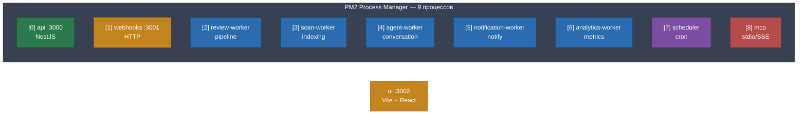
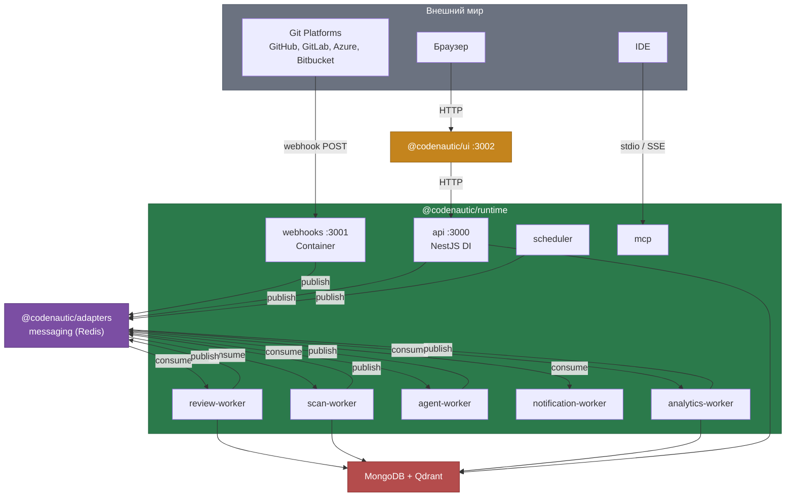
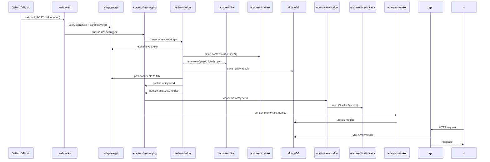

## Инфраструктура: процессы, коммуникация, зависимости

### Процессы (PM2)

9 процессов из 4 пакетов. Все серверные процессы — в одном пакете `@codenautic/runtime`.



| # | Процесс                 | Пакет    | Команда запуска                          | Что делает                                  |
|---|-------------------------|----------|-------------------------------------|---------------------------------------------|
| 0 | **api**                 | `runtime` | `bun run start:api`                 | HTTP API, NestJS, composition root          |
| 1 | **webhooks**            | `runtime` | `bun run start:webhooks`            | Приём webhooks, verify signature, publish   |
| 2 | **review-worker**       | `runtime` | `bun run start:review-worker`       | 20-stage pipeline, SafeGuard, Expert Panel  |
| 3 | **scan-worker**         | `runtime` | `bun run start:scan-worker`         | Repo indexing, AST, Code Graph, CodeCity    |
| 4 | **agent-worker**        | `runtime` | `bun run start:agent-worker`        | Conversation Agent, CCR Summary, @mentions  |
| 5 | **notification-worker** | `runtime` | `bun run start:notification-worker` | Notifications, Report delivery              |
| 6 | **analytics-worker**    | `runtime` | `bun run start:analytics-worker`    | Metrics, Feedback, Causal Analysis, Drift   |
| 7 | **scheduler**           | `runtime` | `bun run start:scheduler`           | Cron: reports, drift scans, health, sprints |
| 8 | **mcp**                 | `runtime` | `bun run start:mcp`                 | IDE integration (stdio/SSE)                 |

### Домены adapters

| Домен         | Роль                                          |
|---------------|-----------------------------------------------|
| **git**       | ACL для GitHub/GitLab/Azure/Bitbucket API     |
| **llm**       | ACL для OpenAI/Anthropic/Google/Groq          |
| **context**   | ACL для Jira/Linear/Sentry/Asana              |
| **notifications** | ACL для Slack/Discord/Teams/Email/Webhook |
| **ast**       | Tree-sitter парсинг, AST-анализ кода          |
| **messaging** | Outbox/Inbox, абстракция над Redis Streams    |
| **worker**    | Shared BullMQ infrastructure                  |
| **database**  | MongoDB schemas, repositories                 |

### Очереди (BullMQ / Redis Streams)

| Очередь              | Producer                                      | Consumer            | Данные                    |
|----------------------|-----------------------------------------------|---------------------|---------------------------|
| `review.trigger`     | webhooks, api                                 | review-worker       | MR id, config             |
| `review.retry`       | review-worker                                 | review-worker       | Retry failed stage        |
| `scan.repo`          | api, webhooks                                 | scan-worker         | Repository id             |
| `scan.update`        | webhooks                                      | scan-worker         | Incremental update (push) |
| `agent.conversation` | webhooks                                      | agent-worker        | @mention event            |
| `agent.summary`      | webhooks, api                                 | agent-worker        | CCR summary request       |
| `notify.send`        | review-worker, agent-worker, analytics-worker | notification-worker | Notification payload      |
| `report.deliver`     | scheduler                                     | notification-worker | Report config             |
| `analytics.metrics`  | review-worker                                 | analytics-worker    | Review metrics            |
| `analytics.feedback` | api                                           | analytics-worker    | User feedback             |
| `analytics.drift`    | scheduler                                     | analytics-worker    | Drift scan trigger        |

### Коммуникация между процессами



### Каналы коммуникации

| Откуда                                      | Куда            | Канал                                           | Что передаёт |
|---------------------------------------------|-----------------|-------------------------------------------------|--------------|
| **webhooks** → workers                      | Redis (BullMQ)  | review.trigger, scan.update, agent.conversation |
| **api** → workers                           | Redis (BullMQ)  | scan.repo, agent.summary, analytics.feedback    |
| **scheduler** → workers                     | Redis (BullMQ)  | report.deliver, analytics.drift                 |
| **review-worker** → **notification-worker** | Redis (BullMQ)  | notify.send (review done)                       |
| **review-worker** → **analytics-worker**    | Redis (BullMQ)  | analytics.metrics                               |
| workers → **MongoDB/Qdrant**                | Direct DB write | Результаты анализа                              |
| **ui** → **api**                            | HTTP (REST)     | Запросы от пользователя                         |
| **mcp** → **api**                           | HTTP (REST)     | IDE-интеграция                                  |
| **api** → **MongoDB/Redis**                 | Direct          | Чтение данных, кеш                              |

**Принципы:**

- **Синхронно (HTTP):** только `ui → api` и `mcp → api`
- **Асинхронно (BullMQ):** всё остальное — через очереди
- **Прямого общения между процессами нет** — всё через Redis или DB
- **webhooks** должен ответить GitHub за 10 секунд — только publish в очередь и 200
- **scheduler** только публикует задачи — не обрабатывает сам
- **api** не знает о workers напрямую — читает готовые результаты из БД
- Каждый процесс масштабируется **независимо** через PM2

### Граф зависимостей (пакеты)

```
core (0 зависимостей)
  ↓
adapters (зависит от core)
  ↓
runtime (зависит от core + adapters)

ui (HTTP → runtime)
```

### Какие домены adapters подключает каждый процесс

```
                     git  llm  ctx  notif  ast  msg  worker  db
api                   ✓    ✓    ✓     ✓     ✓    ✓     ✓     ✓
webhooks              ✓    ·    ·     ·     ·    ✓     ·     ·
review-worker         ✓    ✓    ✓     ·     ·    ✓     ✓     ✓
scan-worker           ✓    ·    ·     ·     ✓    ✓     ✓     ✓
agent-worker          ✓    ✓    ✓     ·     ·    ✓     ✓     ·
notification-worker   ·    ·    ·     ✓     ·    ✓     ✓     ·
analytics-worker      ·    ·    ✓     ·     ·    ✓     ✓     ·
scheduler             ·    ·    ·     ·     ·    ✓     ✓     ✓
mcp                   ·    ·    ·     ·     ·    ·     ·     ·
```

`✓` = подключает через DI, `·` = не использует

### Поток данных (review pipeline)


