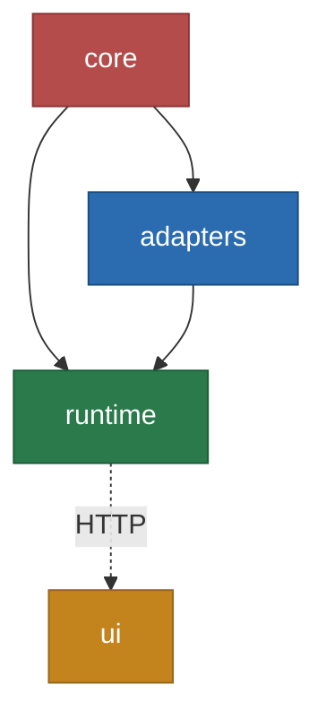

## Монорепо и зависимости

> Схемы и дерево ниже описывают целевую архитектуру на уровне пакетов; внутренние директории и файлы могут меняться по мере реализации.

```
packages/
├── core/              → Домен + Application + Порты (ЯДРО, 0 внешних зависимостей)
├── adapters/          → ACL-адаптеры, AST, Messaging, Worker Infra, Database (driven)
├── runtime/           → API + Webhooks + 6 Workers + Scheduler + MCP (driving, 9 PM2-процессов)
└── ui/                → Frontend, Vite + React + TanStack Router (driving)
```



> Фаза 1 (core) → Фаза 2 (adapters) → Фаза 3 (runtime) → Фаза 4 (ui)

- `core` не зависит ни от кого
- `adapters` зависит только от `core`
- `runtime` зависит от `core` + `adapters`
- `ui` — HTTP-клиент, вызывает `runtime` по сети, не импортирует другие пакеты
- 4 пакета, 3 ребра зависимостей

### Организация папок

| Пакет              | Путь                     | Назначение                                                          |
|--------------------|--------------------------|---------------------------------------------------------------------|
| **core**           | `packages/core`          | Ядро: домен, use cases, порты                                       |
| **adapters**       | `packages/adapters`  | ACL-адаптеры (Git, LLM, Context, Notifications), AST, Messaging, Worker Infra, Database |
| **runtime**        | `packages/runtime`   | 9 PM2-процессов: API, Webhooks, 6 Workers, Scheduler, MCP          |
| **ui**             | `packages/ui`        | Frontend: Vite + React + TanStack Router                            |

npm scope: `@codenautic/core`, `@codenautic/adapters`, `@codenautic/runtime`, `@codenautic/ui`

### Домены adapters

| Домен           | Описание                                      |
|-----------------|-----------------------------------------------|
| Git             | GitHub, GitLab, Azure DevOps, Bitbucket ACL   |
| LLM             | OpenAI, Anthropic, Google, Groq, OpenRouter   |
| Context         | Jira, Linear, Sentry, Asana, ClickUp          |
| Notifications   | Slack, Discord, Teams, Email, Webhook          |
| AST             | Tree-sitter, Code Graph, PageRank              |
| Messaging       | Outbox/Inbox, Redis Streams                    |
| Worker          | BullMQ, Redis, DLQ, graceful shutdown          |
| Database        | MongoDB schemas, repositories                  |

### Процессы runtime

| Процесс              | Команда запуска                     | IoC Container |
|-----------------------|-------------------------------------|---------------|
| api                   | `bun run start:api`                 | NestJS DI     |
| webhooks              | `bun run start:webhooks`            | Container     |
| review-worker         | `bun run start:review-worker`       | Container     |
| scan-worker           | `bun run start:scan-worker`         | Container     |
| agent-worker          | `bun run start:agent-worker`        | Container     |
| notification-worker   | `bun run start:notification-worker` | Container     |
| analytics-worker      | `bun run start:analytics-worker`    | Container     |
| scheduler             | `bun run start:scheduler`           | Container     |
| mcp                   | `bun run start:mcp`                 | Container     |
