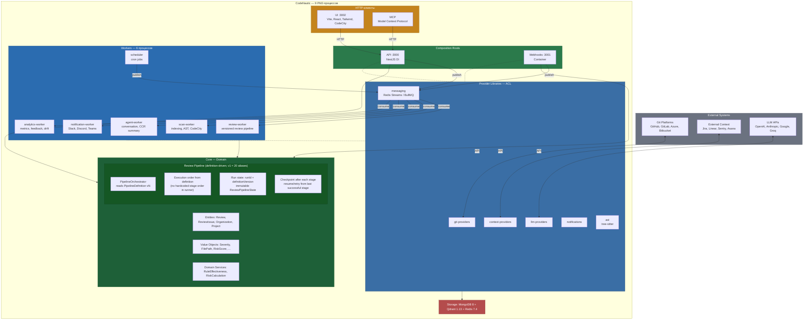
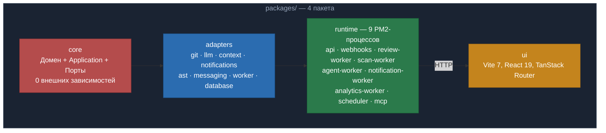
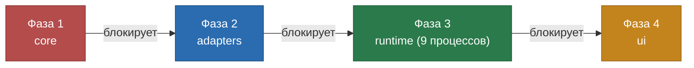

# CodeNautic — Product Overview

> AI-powered code intelligence platform. Автоматический code review, архитектурный анализ, визуализация кодовой базы и
> предсказание проблемных зон.

---

## Что такое CodeNautic?

CodeNautic — AI-powered code intelligence platform. Ядро — автоматический анализ merge requests через definition-driven
review pipeline (v1 включает 20 stage aliases) с LLM. Помимо code review: визуализация кодовой базы (CodeCity),
архитектурный анализ, предсказание проблемных зон,
командные метрики и обучение на фидбеке. Система интегрируется с основными Git-платформами, использует несколько
AI-провайдеров и обогащает контекст данными из трекеров задач и мониторинга.

**Ключевая идея:** вместо ручного ревью или простых линтеров — глубокий AI-анализ кода с пониманием контекста проекта,
истории изменений, архитектуры и бизнес-логики.

---

## Проблема

- Ручное code review — узкое место в процессе разработки: медленно, субъективно, зависит от доступности ревьюеров
- Существующие инструменты (линтеры, SAST) находят только поверхностные проблемы — стилистику и известные паттерны
- Нет инструмента, который понимает контекст задачи (Jira/Linear), историю ошибок (Sentry) и архитектуру проекта
  одновременно
- Code review quality деградирует при большом объёме изменений — ревьюеры устают и пропускают проблемы

## Решение

CodeNautic автоматически:

1. Получает MR/PR через webhook от Git-платформы
2. Собирает контекст: diff, связанные задачи, историю ошибок, архитектуру проекта
3. Прогоняет через orchestrated event-driven pipeline с AI-анализом
4. Фильтрует галлюцинации и дубли через SafeGuard
5. Публикует найденные проблемы как комментарии к MR/PR
6. Обучается на фидбеке: если разработчик отклоняет замечание — система запоминает

---

## Поддерживаемые интеграции

### Git-платформы (Driving)

| Платформа    | Статус | Возможности                                     |
|--------------|--------|-------------------------------------------------|
| GitHub       | Готово | Octokit SDK, Check Runs API, HMAC-SHA256 verify |
| GitLab       | Готово | Gitbeaker SDK, Pipeline API, Discussion threads |
| Azure DevOps | Готово | Azure SDK, Pull Request threads                 |
| Bitbucket    | Готово | Atlassian SDK, Code Insights API                |

### LLM-провайдеры (AI)

| Провайдер  | Статус | Модели                                  |
|------------|--------|-----------------------------------------|
| OpenAI     | Готово | GPT-4o, GPT-4o-mini, streaming, tools   |
| Anthropic  | Готово | Claude 3/4, streaming, tool use, Voyage |
| Google     | Готово | Gemini 2.x, streaming, text-embedding   |
| Groq       | Готово | Llama, Mixtral — быстрый inference      |
| OpenRouter | Готово | Мульти-модельный роутинг                |
| Cerebras   | Готово | Ультра-быстрый inference                |
| Novita     | Готово | OpenAI-совместимый API                  |

### Внешний контекст (Enrichment)

| Источник | Статус      | Данные                               |
|----------|-------------|--------------------------------------|
| Jira     | Готово      | Описание задачи, acceptance criteria |
| Linear   | Готово      | GraphQL, описание issue, sub-issues  |
| Sentry   | Готово      | Stack traces, частота ошибок         |
| Asana    | Готово      | Задачи, проекты                      |
| ClickUp  | Готово      | Задачи, чеклисты                     |
| Datadog  | Планируется | Метрики, APM traces                  |
| Bugsnag  | Планируется | Error tracking                       |
| PostHog  | Планируется | Product analytics                    |
| Trello   | Планируется | Карточки, доски                      |
| Notion   | Планируется | Документация, спеки                  |

### Уведомления

| Канал   | Статус |
|---------|--------|
| Slack   | Готово |
| Discord | Готово |
| Teams   | Готово |

---

## Архитектура

### Высокоуровневая схема

### Принципы

- **Clean Architecture + Hexagonal (Ports & Adapters)** — зависимости направлены строго внутрь
- **DDD** — Entities, Value Objects, Aggregates, Domain Events, Factories
- **SOLID** — один файл = один класс, маленькие интерфейсы, инверсия зависимостей
- **IoC** — `Container` из core для пакетов, NestJS DI для API
- **Anti-Corruption Layer** — каждая внешняя система изолирована через ACL
- **Transactional Messaging** — Outbox/Inbox pattern для надёжной доставки событий

### Монорепо: 4 пакета

### Фазы сборки

> 9 PM2-процессов находятся в одном пакете `runtime`; внутренняя структура файлов может меняться. `adapters` объединяет все провайдеры и библиотеки.
> 9 процессов, 4 пакета.

---

## Ключевые возможности

### 1. Definition-Driven Review Pipeline (v1: 20 stage aliases)

Каждый merge request проходит через versioned pipeline definition.

- `PipelineDefinition v1` содержит canonical aliases из 20 stage.
- Реальный порядок и состав стадий читаются из `definitionVersion`, а не хардкодятся в runner.
- Каждый `PipelineRun` фиксирует `definitionVersion` на старте (pinning).
- После каждого stage сохраняется checkpoint, что позволяет корректный resume/retry.

Ниже перечислены canonical aliases для `v1`:

| #  | Stage                 | Назначение                                      |
|----|-----------------------|-------------------------------------------------|
| 1  | ValidatePrerequisites | Проверка входных данных и прав доступа          |
| 2  | FetchDiff             | Получение diff из Git-платформы                 |
| 3  | FetchExternalContext  | Сбор контекста из Jira/Linear/Sentry            |
| 4  | ChunkDiff             | Разбиение diff на анализируемые куски           |
| 5  | AnalyzeChunks         | AI-анализ каждого chunk                         |
| 6  | DetectPatterns        | Обнаружение паттернов и антипаттернов           |
| 7  | ApplyCustomRules      | Применение пользовательских правил организации  |
| 8  | FilterDuplicates      | SafeGuard: дедупликация                         |
| 9  | FilterHallucinations  | SafeGuard: фильтрация галлюцинаций LLM          |
| 10 | FilterBySeverity      | Фильтрация по пороговой серьёзности             |
| 11 | CheckImplementation   | Проверка релевантности к реальному коду         |
| 12 | ScoreRisk             | Оценка риска каждой проблемы                    |
| 13 | RankIssues            | Ранжирование по приоритету                      |
| 14 | GenerateSuggestions   | Генерация конкретных предложений по исправлению |
| 15 | FormatComments        | Форматирование для Git-платформы                |
| 16 | PostComments          | Публикация комментариев к MR/PR                 |
| 17 | CollectMetrics        | Сбор метрик ревью                               |
| 18 | ProcessFeedback       | Обработка фидбека разработчиков                 |
| 19 | UpdateAnalytics       | Обновление аналитики                            |
| 20 | EmitEvents            | Публикация domain events                        |

### 2. SafeGuard — фильтрация AI-ошибок

Набор фильтров, защищающих от типичных проблем LLM:

- **DeduplicationFilter** — удаление дублирующихся замечаний
- **HallucinationFilter** — отсев несуществующих проблем (галлюцинации LLM)
- **SeverityThresholdFilter** — отсечение по минимальной серьёзности
- **PrioritySortFilter** — сортировка по приоритету
- **ImplementationCheckFilter** — проверка, что замечание относится к реальному коду

### 3. Expert Panel — мульти-LLM ревью

Система "экспертной панели": несколько LLM-провайдеров анализируют код параллельно, результаты агрегируются. Разные
модели находят разные типы проблем.

### 4. Continuous Learning — обучение на фидбеке

- Разработчик принимает/отклоняет замечание → система запоминает
- Rule Effectiveness tracking: эффективность каждого правила измеряется
- Адаптация к стилю команды со временем

### 5. Custom Rules — пользовательские правила

- Организация создаёт свои правила ревью
- Rules Library с категоризацией
- Rule Inheritance: организация → проект → репозиторий
- Prompt Seeds + Rule Seeds для начальной настройки

### 6. AST Analysis — понимание структуры кода

- Tree-sitter парсинг: TypeScript, JavaScript, Python, Go, Java, Rust, PHP, C#, Ruby (готово), Kotlin (планируется)
- Code Graph: граф зависимостей между модулями
- PageRank для определения критичности файлов
- Impact Analysis: оценка влияния изменений
- Cluster Computation: Louvain communities для модульности
- Graph Diff: отслеживание изменений в графе между коммитами

### 7. Architecture Analysis

- Граф зависимостей проекта (dependency graph)
- Обнаружение циклических зависимостей
- Анализ связности компонентов
- Рекомендации по архитектурным улучшениям

### 8. CCR Summary

- Автоматическая генерация описания CCR
- Суммаризация изменений с AI
- Категоризация по типу (feature, fix, refactor)

### 9. Conversation Agent

- Интерактивный AI-агент в комментариях PR
- Через @mentions: разработчик может задать вопрос AI в контексте кода
- Ответы учитывают полный контекст MR

### 10. Multi-Tenancy

- Hybrid tenancy через OrganizationId
- Изоляция данных между организациями
- Настройки на уровне: организация → проект → репозиторий

---

## Планируемые возможности

### CodeCity — 3D-визуализация кодовой базы

Визуализация кодовой базы как "города", где:

- Файлы = здания (высота = сложность, площадь = размер)
- Директории = районы
- Связи = дороги
- Цвет = здоровье кода (зелёный → красный)

Два режима:

- **2D Treemap** — доступен всем, быстрая визуализация
- **3D City** — премиум, интерактивная 3D-сцена (Three.js/React Three Fiber)

Overlay-слои:

- Temporal Coupling: файлы, которые часто меняются вместе
- Health Degradation: тренд ухудшения здоровья кода
- Bug Propagation: распространение багов по графу

### Repository Onboarding

Автоматическое сканирование и индексация нового репозитория:

- Полное дерево файлов, blame data, история коммитов
- Построение графа зависимостей
- Генерация "карты" проекта для контекста AI
- Progress tracking: отображение хода сканирования

### Causal Analysis — причинно-следственный анализ

- **Temporal Coupling**: файлы, которые часто меняются вместе (coupling-паттерны)
- **Bug Tracking**: отслеживание, какие коммиты вносят баги
- **Root Cause Chains**: цепочки первопричин проблем
- **Code Health Trends**: тренды здоровья кода по времени
- **Churn-Complexity Correlation**: корреляция частоты изменений и сложности
- **Regression Patterns**: паттерны регрессий

### Developer Onboarding

- Автоматическая генерация "обзора проекта" для новых разработчиков
- Guided Tour: пошаговое знакомство с архитектурой через UI

### Refactoring Planning

- Автоматическое выявление кандидатов на рефакторинг
- Планирование рефакторинга с оценкой трудозатрат
- Симуляция результатов: как изменится граф после рефакторинга

### Impact Planning

- Симуляция влияния изменений до их реализации
- Blast Radius: какие модули затронет изменение
- Impact Report: визуализация зоны влияния

### Knowledge Map & Bus Factor

- Карта владения файлами: кто какие части знает лучше всего
- Bus Factor: risk assessment — что случится, если ключевой разработчик уйдёт
- Team Knowledge: распределение знаний по команде
- Ownership Timeline: как менялось владение со временем

### Predictive Analytics

- Предсказание "горячих точек" — файлов, где вероятны баги
- Trend Analysis: экстраполяция трендов здоровья кода
- Объяснение предсказаний: почему модель считает файл рискованным

### Sprint Gamification

- Snapshot здоровья кода на каждый спринт
- District Trends: тренды по "районам" CodeCity
- Геймификация: метрики улучшения кода за спринт

### Architecture Drift Detection

- Blueprint: определение "эталонной" архитектуры
- Drift Scan: автоматическое обнаружение отклонений от blueprinta
- Drift Score: количественная оценка архитектурного дрифта
- Алерты при нарушении архитектурных правил

### Executive Reports

- Автоматическая генерация отчётов для менеджмента
- Экспорт в разные форматы
- Расписание отправки (weekly, monthly)
- Summary Generator: AI-суммаризация

### Review Context Enhancement

- Автоматический подбор ревьюеров на основе Knowledge Map
- Risk Calculator: оценка рискованности MR на основе графа и истории
- Suggested Reviewers: рекомендации, кого привлечь к ревью

---

## Стратегический Roadmap

> Полный roadmap с четырьмя фазами (Launch → KAG Foundation → Расширение → Self-Improvement), Knowledge Augmented
> Generation, 39 новыми возможностями и prerequisites — в **`ROADMAP.md`**.

---

## Tech Stack

> Подробный tech stack — в `.soul/tech-stack.md` и `package.json` каждого пакета.

---

## Версионирование

- **SemVer**: `MAJOR.MINOR.PATCH`
- **Prefixed tags**: `core-v0.1.0`, `api-v0.2.0`
- До `1.0` — minor может содержать breaking changes
- Проект спланирован на **33+ мажорных версий** с полной roadmap
- Каждый пакет версионируется независимо

---

## Почему CodeNautic?

### Ваша боль — мы знаем

| Проблема                    | Цена                                        | Как это выглядит                                                                                            |
|-----------------------------|---------------------------------------------|-------------------------------------------------------------------------------------------------------------|
| **Ревьюер — узкое место**   | 2-5 дней ожидания на каждый PR              | Senior-разработчик завален ревью, джуниоры ждут. Релиз задерживается                                        |
| **Качество ревью падает**   | 40% проблем пропускается при PR > 400 строк | Ревьюер устал, написал "LGTM", баг ушёл в прод                                                              |
| **Линтер ≠ ревью**          | Линтер находит стиль, но не логику          | `if (user.role === "admin")` в контроллере линтер не поймает. CodeNautic — поймает                          |
| **Нет контекста**           | Ревьюер не знает задачу из Jira             | Без контекста замечания поверхностные: "переименуй переменную" вместо "логика не соответствует требованиям" |
| **Знание уходит с людьми**  | Bus factor = 1                              | Ушёл ведущий разработчик — никто не знает как устроен модуль оплаты                                         |
| **Архитектура деградирует** | Техдолг растёт незаметно                    | Через год "быстрых фиксов" архитектура превращается в клубок спагетти                                       |
| **Нет видимости**           | CTO не знает реальное состояние кода        | "Как здоровье нашей кодовой базы?" — тишина                                                                 |

### Что CodeNautic делает для вас

**Для разработчиков:**

- PR получает ревью за **минуты, не дни** — AI анализирует 20 аспектов параллельно
- Замечания с **конкретными предложениями** по исправлению, а не абстрактные "плохо"
- @mention в PR — задай вопрос AI в контексте кода и получи ответ
- Автоматическое описание PR — не нужно писать "что изменил" вручную

**Для тимлидов:**

- **SafeGuard** фильтрует AI-галлюцинации — только релевантные замечания, не шум
- Система **учится на фидбеке** — отклонил замечание? CodeNautic запомнит и не повторит
- **Пользовательские правила** — кодифицируй стандарты команды, CodeNautic их применяет
- **Knowledge Map** — видишь кто какой код знает, bus factor каждого модуля

**Для CTO/VP Engineering:**

- **CodeCity** — 3D-визуализация здоровья кодовой базы. Красный район = проблемная зона
- **Architecture Drift** — автоматическое обнаружение: "модуль X отклонился от архитектуры на 23%"
- **Predictive Analytics** — "файл payment-service.ts с 78% вероятностью вызовет баг в следующем спринте"
- **Executive Reports** — еженедельные отчёты о здоровье кода без ручной работы
- **Multi-platform** — GitHub, GitLab, Azure DevOps, Bitbucket. Одна платформа для всего

**Для бизнеса:**

- **Быстрее релизы** — ревью не блокирует pipeline
- **Меньше багов в проде** — AI ловит то, что ревьюер пропустил от усталости
- **Дешевле онбординг** — новый разработчик видит карту проекта, не бродит вслепую
- **Self-hosted** — код и данные остаются внутри вашей инфраструктуры
- **Enterprise-ready** — RBAC, шифрование AES-256, audit logs, multi-tenancy

### Не просто линтер

|                                   | Линтер | GitHub Copilot | CodeNautic     |
|-----------------------------------|--------|----------------|----------------|
| Стиль кода                        | +      | +              | +              |
| Логические ошибки                 | -      | Частично       | **+**          |
| Контекст задачи (Jira/Linear)     | -      | -              | **+**          |
| История ошибок (Sentry)           | -      | -              | **+**          |
| Архитектурный анализ              | -      | -              | **+**          |
| Визуализация кодовой базы         | -      | -              | **+**          |
| Обучение на фидбеке               | -      | -              | **+**          |
| Фильтрация AI-галлюцинаций        | -      | -              | **+**          |
| Мульти-LLM (Expert Panel)         | -      | -              | **+**          |
| Предсказание проблемных зон       | -      | -              | **+**          |
| Self-hosted                       | -      | -              | **+**          |

### Бренд

**CodeNautic** = Code + Nautic(al) + Navigator.

Nautic — от латинского *nauticus* (мореходный, навигационный). Наутилус — живое ископаемое, **500 миллионов лет** без
изменений. Пережил 5 массовых вымираний. Его раковина — логарифмическая спираль, золотое сечение. Каждая камера
пропорциональна предыдущей — как слои чистой архитектуры.

**-nautic** — навигационный: astro**nautic**s, aero**nautic**s, Code**Nautic**. Навигационная система для кода —
погружается в глубину и видит структуру, пропорции и проблемы, которые на поверхности не видны.

| Свойство наутилуса                | Свойство CodeNautic                                 |
|-----------------------------------|-----------------------------------------------------|
| 500 млн лет без изменений         | Стабильная архитектура, проверенная временем        |
| Камеры раковины                   | Слои анализа: versioned pipeline (v1: 20 aliases)   |
| Живёт на глубине 200-700м         | Погружается в глубину кода глубже любого линтера    |
| Пережил 5 массовых вымираний      | Справится с любым legacy и техдолгом                |
| Золотое сечение раковины          | Математическая точность анализа, не субъективность  |
| Навигация через камеры плавучести | Навигатор по кодовой базе — CodeCity, граф, метрики |

### Визуальная идентичность

- **Лого:** стилизованная раковина наутилуса — логарифмическая спираль. Каждый виток — слой архитектуры
- **Цвета:** глубокий океан — тёмно-синий + бирюзовый + золотой акцент
- **Favicon:** спираль. Узнаваема в 16x16
- **Слоган:** «Структура. Глубина. Точность.»
