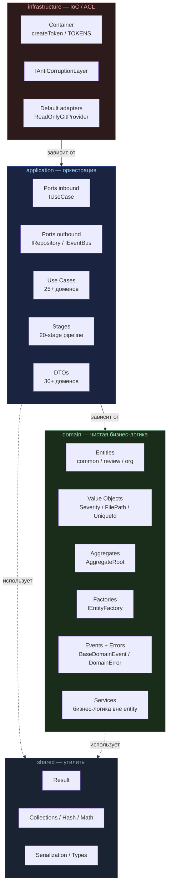

# @codenautic/core

> Domain + Application + Ports + Shared Utilities

---

## Назначение

Ядро CodeNautic — чистый domain layer без внешних зависимостей. Содержит бизнес-логику, use cases, порты (интерфейсы для
DI), DTO и утилиты. Все остальные пакеты зависят от core, core не зависит ни от кого.

---

## Текущее состояние

| Аспект      | Значение                                              |
|-------------|-------------------------------------------------------|
| Версия      | 0.29.0                                                |
| Статус      | Active development                                    |
| Runtime     | Bun 1.2, TypeScript 5.7                               |
| Зависимости | 0 external (только dev: ESLint, Prettier, TypeScript) |

---

## Архитектура

Clean Architecture + DDD. Зависимости направлены строго внутрь:



- **Domain** не импортирует Application и Infrastructure
- **Application** не импортирует Infrastructure
- Внешние зависимости — только через порты (`application/ports/`)

---

## Архитектурные правила

- **Направление зависимостей:** только внутрь (`infrastructure -> application -> domain`).
- **Domain слой** не зависит от framework/IO и не импортирует `application` или `infrastructure`.
- **Use Case** содержит оркестрацию, а не бизнес-правила; бизнес-инварианты живут в `domain`.
- **Границы интеграций** проходят через порты (`application/ports/inbound`, `application/ports/outbound`).
- **Внешние типы** не проникают в domain; маппинг выполняется в ACL (`infrastructure/acl`).
- **Entity/Aggregate** создаются через фабрики (`create`/`reconstitute`), а не через ad-hoc конструирование.
- **DI обязателен:** в use cases не создаём concrete-классы через `new`, зависимости приходят через контейнер.
- **Структура по bounded context:** папки `feature/` и `features/` в `core` не используются.

---

## Структура

Текущая структура описывается на уровне слоёв (без жёсткой фиксации конкретных путей и файлов):

- **Domain**: сущности и инварианты (`entities`, `value-objects`, `aggregates`, `factories`, `events`, `errors`, `services`)
- **Application**: оркестрация (`use-cases`), входные/выходные порты, DTO и pipeline-компоненты
- **Infrastructure**: технические реализации (IoC, ACL, адаптеры, worker-утилиты)
- **Shared**: утилиты общего назначения (`result`, коллекции, типы и т.д.)

Правила организации:

- Поддиректории bounded context (например, `review/`, `prompt/`, `organization/`) добавляются симметрично по мере необходимости.
- Один файл = одна основная сущность; имя файла в `kebab-case`, экспорт соответствует имени основной сущности.
- `index.ts` используется только как слой/контекстный barrel, не как место для бизнес-логики.

---

## Базовые классы

| Что создаёшь   | Наследуй / реализуй             |
|----------------|---------------------------------|
| Entity         | `Entity<TProps>`                |
| Value Object   | `ValueObject<T>`                |
| Aggregate Root | `AggregateRoot<TProps>`         |
| Factory        | `IEntityFactory<T, C, R>`       |
| Domain Event   | `BaseDomainEvent`               |
| Domain Error   | `DomainError`                   |
| Use Case       | `IUseCase<In, Out, Err>`        |
| Repository     | `IRepository<T>`                |
| Event Handler  | `IEventHandler<T>`              |
| ACL            | `IAntiCorruptionLayer<E, D>`    |
| Идентификатор  | `UniqueId.create()`             |
| Результат      | `Result.ok()` / `Result.fail()` |
| IoC-токен      | `createToken<T>("name")`        |

---

## Использование

```typescript
import {
    Entity,
    ValueObject,
    AggregateRoot,
    UniqueId,
    Result,
    DomainError,
    BaseDomainEvent,
} from "@codenautic/core"

import type { IUseCase, IRepository, IEntityFactory, IAntiCorruptionLayer } from "@codenautic/core"

import { createToken, TOKENS } from "@codenautic/core"
```

---

## Установка

```bash
bun add @codenautic/core
```

---

## Разработка

```bash
cd packages/core

bun run build          # tsc --project tsconfig.build.json
bun run clean          # rm -rf dist
bun run format         # prettier --write .
bun run format:check   # prettier --check .
bun run lint           # eslint .
bun test               # bun test
bun run typecheck      # tsc --noEmit
```

---

## План задач

- Индекс milestones: [`TODO.md`](./TODO.md)
- Детальные milestone-файлы: [`todo/`](./todo/)

---

## Зависимости

```
core ← git-providers, llm-providers, context-providers, notifications,
       mcp, messaging, ast, worker, webhooks, api, ui
```

Core не зависит ни от кого. Все пакеты монорепо зависят от core.
